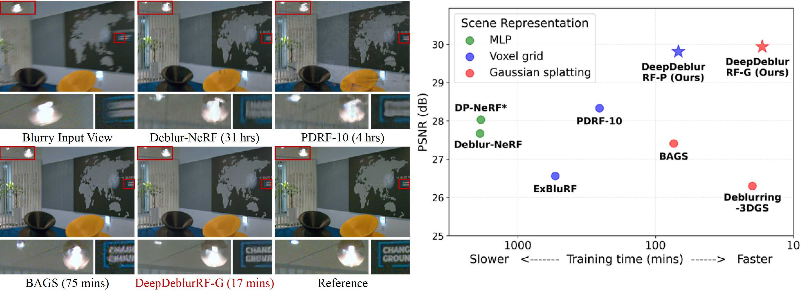

# [CVPR 2025] Exploiting Deblurring Networks for Radiance Fields (DeepDeblurRF)<br><sub>- Official PyTorch Implementation -</sub>  
🎯 *Fast and high-quality novel view synthesis from blurry images using iterative deblurring and radiance field construction.*

[](https://haeyun-choi.github.io/DDRF_page/)
[](https://arxiv.org/abs/2502.14454)
[](https://drive.google.com/drive/folders/12t5J8VW102c2eXuj90RY9nVw5Uyv2YQ8)

**Exploiting Deblurring Networks for Radiance Fields**  
Haeyun Choi, Heemin Yang, Janghyuk Han, Sunghyun Cho  
KT, POSTECH

## Overview


## Abstract
*In this paper, we propose DeepDeblurRF, a novel radiance field deblurring approach that can synthesize high-quality novel views from blurred training views with significantly reduced training time. DeepDeblurRF leverages deep neural network (DNN)-based deblurring modules to enjoy their deblurring performance and computational efficiency. To effectively combine DNN-based deblurring and radiance field construction, we propose a novel radiance field (RF)-guided deblurring and an iterative framework that performs RF-guided deblurring and radiance field construction in an alternating manner. Moreover, DeepDeblurRF is compatible with various scene representations, such as voxel grids and 3D Gaussians, expanding its applicability. We also present BlurRF-Synth, the first large-scale synthetic dataset for training radiance field deblurring frameworks. We conduct extensive experiments on both camera motion blur and defocus blur, demonstrating that DeepDeblurRF achieves state-of-the-art novel-view synthesis quality with significantly reduced training time.*

## News  
[Feb 26, 2025] Our paper has been accepted to CVPR 2025! 🎉  
[Feb 27, 2025] Code & dataset will be released soon  
[Apr 2, 2025] Test dataset has been released! 🚀

## 📦 Iterative Pipeline Structure in DeepDeblurRF

DeepDeblurRF is built as an iterative pipeline that progressively refines novel view synthesis from blurry inputs. Each iteration consists of radiance field (RF) construction and RF-guided deblurring. The structure below summarizes the process:

| Iteration (`index`) | RF Input Folder | Rendered Views (train/test) | NAFNet Settings       | RF-Guided Deblur Output | Final Output         |
|---------------------|------------------|-------------------------------|----------------------------|--------------------------|-----------------------|
| 0                   | `rf_0`           | `trviews_0`, `tsviews_0`     | `NAFNet-width64_1.yml`     | `deblur_1`               | ❌                    |
| 1                   | `rf_1`           | `trviews_1`, `tsviews_1`     | `NAFNet-width64_2.yml`     | `deblur_2`               | ❌                    |
| 2                   | `rf_2`           | `trviews_2`, `tsviews_2`     | `NAFNet-width64_3.yml`     | `deblur_3`               | ❌                    |
| 3                   | `rf_3`           | `trviews_3`, `tsviews_3`     | `NAFNet-width64_4.yml`     | `deblur_4`               | ❌                    |
| 4                   | `rf_4`           | `trviews_4`, `tsviews_4`     | *(skipped)*                | *(not created)*          | ✅ `tsviews_4`         |

- Each iteration uses `rf_{index}` as the input for COLMAP and a radiance field (RF) construction method.
- Rendered views `trviews_{index}`, `tsviews_{index}` are generated from the trained RF.
- RF-guided deblurring is applied using the original `blur` images and the rendered `trviews`, resulting in `deblur_{index+1}`.
- NAFNet weights (`NAFNet-width64_k.yml`) change per iteration (up to 4 models); beyond that, the last model is reused.
- On the final iteration, deblurring is skipped and `tsviews_4` is considered the final output.

📁 Final results are saved in:
```
data/<scene_name>/Final_results_iteration_4/
```

📁 Example:
```
data/cozyroom/Final_results_iteration_4/
```

🔄 **Note:** The radiance field module used in each iteration is modular and can be replaced with other RF representations (e.g., voxel grids, NeRF). 

## 🙏 Acknowledgements

This project builds upon the following works. We thank the authors for open-sourcing their excellent codebases:

- [NAFNet (ECCV 2022)](https://github.com/megvii-research/NAFNet)
- [Plenoxels / SVoX2 (svox2, CVPR 2022)](https://github.com/sxyu/svox2)
- [3D Gaussian Splatting (SIGGRAPH 2023)](https://github.com/graphdeco-inria/gaussian-splatting)

## 📖 Citation

If you find this work useful for your research, please consider citing:

```bibtex
@article{choi2025exploiting,
  title={Exploiting Deblurring Networks for Radiance Fields},
  author={Choi, Haeyun and Yang, Heemin and Han, Janghyeok and Cho, Sunghyun},
  journal={CVPR},
  year={2025}
}
```
